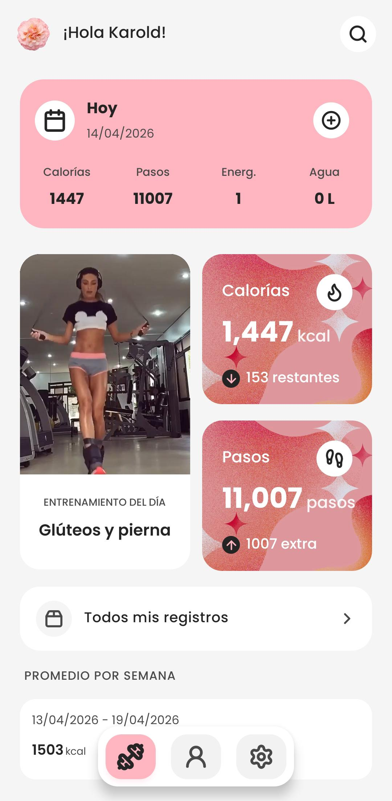
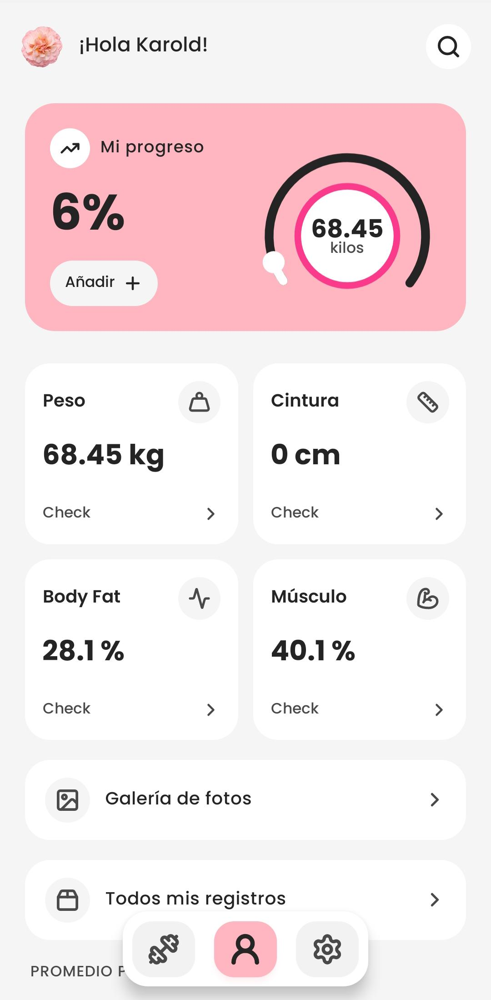
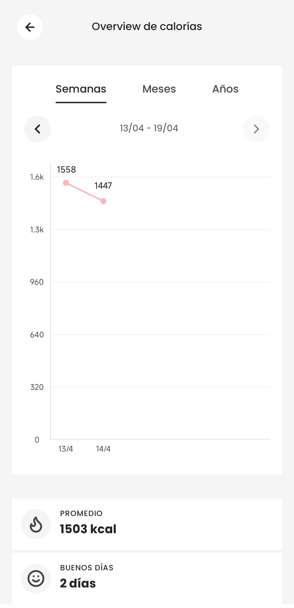

## Trackie

Trackie is a mobile-first application designed to help users track weight, calorie intake, and fitness progress in a simple and consistent way.
The goal is to centralize health tracking into a minimal system focused on long-term habit building.

  
  
  

#### Features

The app allows users to log food intake with calorie tracking, record weight and body measurements over time, and visualize progress through charts. It also provides a simple overview of personal statistics, all wrapped in a clean mobile-first interface designed for daily use.

#### Tech stack

The frontend is built with React Native, while the backend uses NestJS to expose a REST API. Data is stored in PostgreSQL due to its reliability for structured and relational health data.

Infrastructure-wise, Docker is used for containerization, Railway handles deployment, and Cloudinary manages image storage.